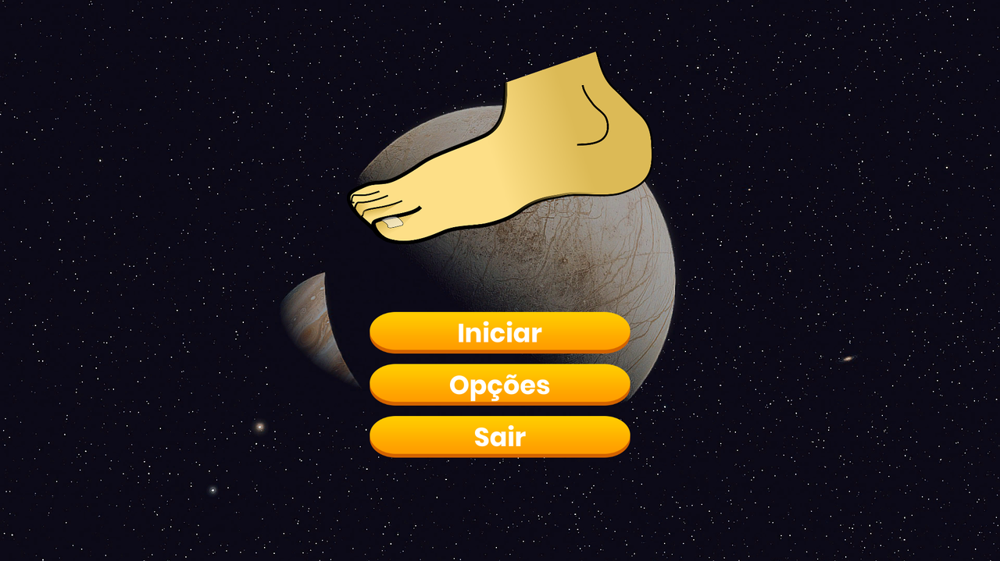
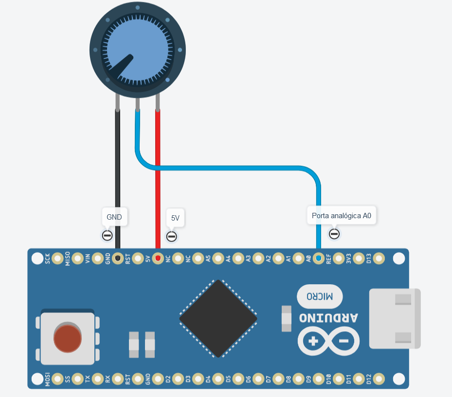
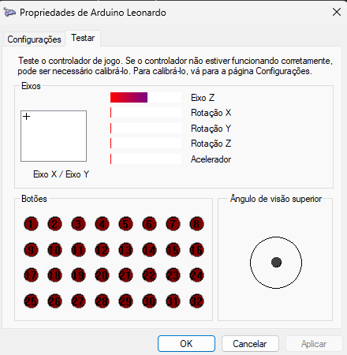

# Pé na lua



Produto Tecnológico desenvolvido durante projeto de Trabalho de Conclusão de Curso "Aplicação de serious game controlado por biossinais para reabilitação da dorsiflexão do tornozelo" do curso de Engenharia de Computação da UTFPR - Campus Apucarana, sob orientação do professor [Dr. Daniel Prado de Campos](https://lattes.cnpq.br/2260564602839139).

A monografia desenvolvida pode ser encontrada no [Repositório Institucional da Universidade Tecnológica Federal do Paraná (RIUT)](http://repositorio.utfpr.edu.br/jspui/handle/1/33487). Caso utilize este sistema, por gentileza, referencie o trabalho.

## Controle

O controle consiste em um pedal acoplado com um potenciômetro como sensor de entrada, e sua estrutura é impressa em [3D](#links) usando o material PETG. A coleta de dados é realizada por meio da biblioteca Arduino `Joystick.h`, utilizando o microcontrolador Arduino Pro Micro.

O circuito consiste na simples conexão do potenciômetro ao Arduino, com um fio no porta 5V, outro no GND, e o fio central em uma porta analógica.




Após o microcontrolador ser carregado com o [código](#links), basta acoplar o potenciômetro no pedal impresso, e ele estará em funcionamento. Para testar, vá para o Painel de Controle > Hardware e Sons > Dispositivos e Impressoras. Encontre o ícone do joystick, clique com o botão direito e vá em Configurações do controlador de jogo > Propriedades. Movimente o pedal e verifique se o eixo Z está sendo acionado. Se sim, o pedal está de fato em funcionamento.



Ao finalizar o desenvolvimento, basta instalar o jogo [Pé na Lua 1.0](https://github.com/GustavoMFreitas/PeNaLua/releases/tag/Game) e testá-lo.

### Atenção:
Na montagem do pedal, é necessário utilizar um método para fixar a parte superior no eixo com engrenagem, a fim de suportar a força de rotação nas engrenagens e evitar o giro falso no eixo. No projeto, um parafuso transversal foi aquecido e atravessou a estrutura para esse propósito.
## Jogo

Utiliza uma nave como personagem principal. O usuário tem controle sobre essa nave por meio do pedal, onde o movimento exercido no pedal é replicado no mundo virtual do jogo. Cada fase do jogo foi projetada para desafiar e aprimorar diferentes aspectos do movimento de dorsiflexão, proporcionando uma abordagem abrangente para a reabilitação. 

O jogo é estruturado em seis fases distintas, cada uma exigindo movimentos específicos de dorsiflexão para progedir e finalizá-la. Destaca-se na sexta fase uma funcionalidade configurável, permitindo que o usuário crie fases personalizadas desenhando gráficos que determinam os desafios a serem enfrentados.

O jogo foi desenvolvido através do motor de jogo Unity e todos seus arquivos estão disponibilizados na pasta [Assets](Assets).

Para aprimorar o jogo, basta clonar este repositório e colar o conteúdo presente na pasta "Assets" para a pasta "Assets" de um novo projeto Unity 3D:

```bash
git clone https://github.com/GustavoMFreitas/PeNaLua
```

### Ideias de Aprimoramento
Elementos que podem ser adicionados ao projeto para torná-lo mais abrangente e como um produto mais completo:

- Sensor mais preciso: Utilização de acelerômetro ou requisição EMG para maior precisão.

- Aprimoramento do Jogo: Adição de mais fases e introdução de diferentes obstáculos.

### Links
- [Arquivos 3d](Models)

- [Código Pedal](Microcontroller)
- [Assets do jogo](Assets).
